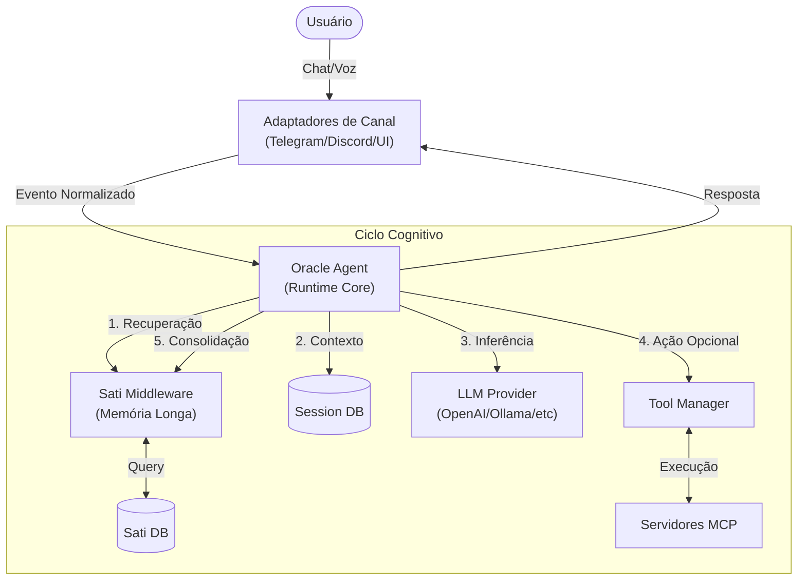

# Morpheus

## 🚀 Visão Geral

**Morpheus** é um operador de IA *local-first* que atua como um elo inteligente entre o desenvolvedor e seus sistemas. Inspirado no conceito de "operador da matrix", ele executa como um daemon persistente em segundo plano, orquestrando interações entre **Grandes Modelos de Linguagem (LLMs)**, **ferramentas locais** e **múltiplos canais de comunicação**.

O projeto resolve o problema da fragmentação e falta de agência das ferramentas de IA atuais. Diferente de um chat "stateless" no navegador, o Morpheus vive na sua máquina, mantém memória de longo prazo (Sati) e possui capacidade real de execução através de MCPs (Model Context Protocol).

### Principais Diferenciais
*   **Soberania de Dados**: Banco de dados e logs locais. Nada sai da sua máquina sem permissão.
*   **Memória Sati**: Sistema de memória dual (curto/longo prazo) que aprende preferências e fatos organicamente.
*   **Arquitetura Plugável**: Integração nativa com ferramentas MCP padrão de mercado.
*   **Presença Omnicanal**: Interaja via Terminal, Web UI ou Telegram (com áudio).

---

## ✨ Features

*   **Agente Persistente**: Daemon Node.js que mantem estado e contexto entre reinicializações.
*   **Suporte Multi-LLM**: Integração agnóstica com OpenAI, OpenRouter, Anthropic, Google Gemini e Ollama.
*   **Memória Sati (Mindfulness)**: 
    *   Middleware que intercepta conversas para extrair e armazenar fatos importantes em `santi-memory.db`.
    *   Configuração independente (permite usar um modelo mais inteligente/barato apenas para gerenciar memória).
*   **Protocolo MCP**: Carregamento dinâmico de ferramentas via arquivo `~/.morpheus/mcps.json`.
*   **Interface Web "Matrix"**: Dashboard local para monitoramento, configuração e chat, protegido por senha (`THE_ARCHITECT_PASS`).
*   **Chatbot Telegram/Discord**: Interface móvel com suporte a transcrição de voz via Google GenAI.
*   **Configuração Hot-Reload**: APIs para ajuste dinâmico de parâmetros do agente sem reiniciar o processo.
*   **Analytics de Uso**: Monitoramento granular de consumo de tokens por provedor e modelo.

---

## 🧠 Arquitetura

O Morpheus utiliza uma arquitetura de **Monólito Modular** com um fluxo de controle baseado em middlewares.

### Diagrama de Alto Nível



### Decisões Arquiteturais
*   **Oracle**: O núcleo orquestrador que implementa a interface de pensamento. É agnóstico ao provedor de IA.
*   **Middleware Sati**: Um "sub-agente" independente que roda antes e depois do ciclo principal para gerir memória sem poluir a lógica de negócio.
*   **Canais Isolados**: Cada canal (Telegram, CLI, HTTP) é um módulo isolado que apenas emite e recebe eventos padronizados.

---

## 📂 Estrutura de Pastas

```
/src
  /channels     # Adaptadores de entrada/saída (Telegram, Discord)
  /cli          # Comandos do terminal e gerenciamento do processo daemon
  /config       # Definições de esquema (Zod) e carregamento de YAML
  /http         # Servidor API Express e rotas REST
  /runtime      # Lógica de negócio central
    /memory     # Implementações de armazenamento (SQLite, Sati)
    /providers  # Factory para instanciar clientes LLM (OpenAI, etc)
    /tools      # Cliente MCP e gerenciador de ferramentas locais
    oracle.ts   # Classe principal do agente
  /ui           # Código fonte do Frontend (React/Vite)
```

---

## ⚙️ Instalação

### Pré-requisitos
*   **Node.js**: v18.0.0 ou superior (Requer suporte a ESM e fetch nativo).
*   **NPM**: v9.0.0 ou superior.
*   **Python/Build Tools**: Necessário em alguns SOs para compilar `better-sqlite3`.

### Instalação Global
Para uso como ferramenta de sistema:

```bash
npm install -g morpheus-cli
```

### Variáveis de Ambiente
Crie um arquivo `.env` na raiz ou configure no seu shell.

| Variável | Descrição | Obrigatória |
| -------- | --------- | ----------- |
| `OPENAI_API_KEY` | Chave de API da OpenAI (se usar GPT) | Não |
| `ANTHROPIC_API_KEY` | Chave de API da Anthropic (se usar Claude) | Não |
| `GOOGLE_API_KEY` | Chave Google AI (para Gemini e Audio) | Sim (p/ Voz) |
| `THE_ARCHITECT_PASS` | Senha de acesso ao Dashboard Web | Recomendado |
| `TELEGRAM_BOT_TOKEN` | Token do BotFather | Não |

---

## ▶️ Como Executar

### Configuração Inicial
Antes de rodar pela primeira vez, gere os arquivos de configuração:

```bash
morpheus init
```
Isso criará a pasta `~/.morpheus` contendo `config.yaml` (configuração geral) e `mcps.json` (ferramentas).

### Produção (Daemon)
Inicia o agente em background e libera o terminal.

```bash
morpheus start
```
*   **Dashboard**: `http://localhost:3333`
*   **Status**: Use `morpheus status` para ver o PID.
*   **Logs**: Use `morpheus logs` (se implementado) ou verifique `~/.morpheus/logs`.

### Desenvolvimento
Para contribuir com o código:

```bash
# Terminal 1: Backend em modo watch
npm run dev:cli

# Terminal 2: Frontend (UI)
npm run dev:ui
```

---

## 🧪 Testes

Os testes são escritos usando **Vitest** e seguem a estratégia de testes unitários e de integração focados em features.

```bash
# Rodar suíte completa
npm test

# Rodar testes de um arquivo específico
npm test oracle
```

**Estrutura**: Os testes ficam em pastas `__tests__` próximas ao código que testam (co-location).

---

## 🔌 Integrações / MCPs

O Morpheus adota o padrão **Model Context Protocol (MCP)** para ferramentas.

### Registro de MCPs
Edite `~/.morpheus/mcps.json` para adicionar servidores. O sistema suporta transportes `stdio` (execução local) e `http` (remoto).

**Exemplo (`mcps.json`):**
```json
{
  "mcpServers": {
    "filesystem": {
      "command": "npx",
      "args": ["-y", "@modelcontextprotocol/server-filesystem", "e:/projetos"]
    },
    "github": {
      "command": "npx",
      "args": ["-y", "@modelcontextprotocol/server-github"],
      "env": { "GITHUB_TOKEN": "ghp_..." }
    }
  }
}
```

---

## 🧩 Como Funciona Internamente

O fluxo de uma interação segue os seguintes passos:

1.  **Recepção**: O `TelegramAdapter` recebe um webhook, valida o `chat_id` contra a allowlist definida em configuração.
2.  **Pré-Processamento (Middleware)**:
    *   O endpoint `beforeAgent` do Sati é acionado.
    *   Ele busca no `santi-memory.db` por fatos semanticamente relevantes ao input atual.
    *   Fatos encontrados são injetados como `SystemMessage` no array de mensagens.
3.  **Deliberação (Oracle)**:
    *   O Oracle consulta o LLM configurado.
    *   Se o LLM solicitar uma ferramenta (ex: `read_file`), o Oracle executa via cliente MCP.
    *   O processo se repete até o LLM gerar uma resposta final.
4.  **Pós-Processamento (Middleware)**:
    *   O endpoint `afterAgent` do Sati é acionado com o histórico completo da interação.
    *   Um processo paralelo (Fire-and-forget) analisa a conversa para extrair novos fatos.
    *   Novos fatos são salvos no banco de longo prazo.
5.  **Entrega**: A resposta final é enviada ao usuário via adaptador Telegram.

---

## 📡 API

A API REST roda na porta 3333 (configurável) e serve tanto a UI quanto integrações locais.

### GET `/api/agents`
Retorna o estado de saúde do agente e providers ativos.

### GET `/api/config/sati`
Recupera a configuração específica do subsistema de memória Sati.

### POST `/api/config/sati`
*   **Descrição**: Atualiza configurações do Sati (Modelo, Provider, Janela).
*   **Body**: `{ "provider": "openai", "model": "gpt-4-turbo", ... }`

### GET `/api/stats/usage`
Retorna métricas de consumo de tokens (Input/Output) acumuladas.

---

## 🏗 Padrões e Decisões Técnicas

*   **Spec-Driven Development**: Nenhuma linha de código é escrita sem uma `spec` aprovada na pasta `specs/`. Isso garante rastreabilidade e clareza arquitetural.
*   **Fail-Open**: Falhas em subsistemas não críticos (como o Sati Memory) não derrubam o processo principal. O log de erro é gerado, mas o chat continua.
*   **Zero-Config Defaults**: O comando `init` gera uma configuração funcional padrão para minimizar o atrito inicial.
*   **Typescript Strict**: Uso rigoroso de tipagem para contratos entre módulos (Frontend <-> Backend <-> Config).

---

## 🤝 Contribuição

1.  Consulte o [Roadmap](ROADMAP.md) ou Issues abertas.
2.  Para novas features, crie uma proposta na pasta `specs/` (ver `001-cli-structure` como exemplo).
3.  Siga o estilo de código (ESLint + Prettier).
4.  Abra um PR com descrição detalhada e link para a Spec.

## 🗺 Roadmap

*   [x] MVP com suporte a LLMs básicos.
*   [x] Integração com Telegram.
*   [x] Web UI Dashboard.
*   [x] Memória de Longo Prazo (Sati).
*   [ ] Suport ao Discord
*   [ ] Ferramentas de Iteração com  Sistema de Arquivos Local.
*   [ ] Iteração com terminal local.

---

## 📄 Licença

Este projeto é open-source sob a licença **ISC**. Veja o arquivo `LICENSE` para mais detalhes.
