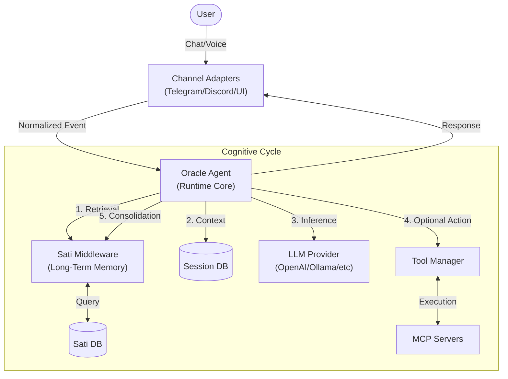

# Morpheus

## 🚀 Overview

**Morpheus** is a *local-first* AI operator that acts as a smart bridge between the developer and their systems. Inspired by the "matrix operator" concept, it runs as a persistent background daemon, orchestrating interactions between **Large Language Models (LLMs)**, **local tools**, and **multiple communication channels**.

The project solves the problem of fragmentation and lack of agency in current AI tools. Unlike a stateless browser chat, Morpheus lives on your machine, maintains long-term memory (Sati), and has real execution capability through MCPs (Model Context Protocol).

### Key Differentiators
*   **Data Sovereignty**: Local database and logs. Nothing leaves your machine without permission.
*   **Sati Memory**: Dual-layer memory system (short/long term) that organically learns preferences and facts.
*   **Pluggable Architecture**: Native integration with standard MCP tools.
*   **Omnichannel Presence**: Interact via Terminal, Web UI, or Telegram (with audio).

---

## ✨ Features

*   **Persistent Agent**: Node.js daemon that maintains state and context across restarts.
*   **Multi-LLM Support**: Agnostic integration with OpenAI, OpenRouter, Anthropic, Google Gemini, and Ollama.
*   **Sati Memory (Mindfulness)**:
    *   Middleware that intercepts conversations to extract and store important facts in `santi-memory.db`.
    *   Independent configuration (allows using a smarter/cheaper model just for memory management).
*   **MCP Protocol**: Dynamic tool loading via the `~/.morpheus/mcps.json` file.
*   **Matrix Web Interface**: Local dashboard for monitoring, configuration, and chat, password-protected (`THE_ARCHITECT_PASS`).
*   **Telegram/Discord Chatbot**: Mobile interface with voice transcription support via Google GenAI.
*   **Hot-Reload Configuration**: APIs for dynamic agent parameter adjustment without restarting the process.
*   **Usage Analytics**: Granular monitoring of token consumption by provider and model.

---

## 🧠 Architecture

Morpheus uses a **Modular Monolith** architecture with a middleware-based control flow.

### High-Level Diagram



### Architectural Decisions
*   **Oracle**: The orchestrator core that implements the thinking interface. It is agnostic to the AI provider.
*   **Sati Middleware**: An independent "sub-agent" that runs before and after the main cycle to manage memory without polluting business logic.
*   **Isolated Channels**: Each channel (Telegram, CLI, HTTP) is an isolated module that only emits and receives standardized events.

---

## 📂 Folder Structure

```
/src
  /channels     # Input/output adapters (Telegram, Discord)
  /cli          # Terminal commands and daemon process management
  /config       # Schema definitions (Zod) and YAML loading
  /http         # Express API server and REST routes
  /runtime      # Core business logic
    /memory     # Storage implementations (SQLite, Sati)
    /providers  # Factory for LLM clients (OpenAI, etc)
    /tools      # MCP client and local tool manager
    oracle.ts   # Main agent class
  /ui           # Frontend source code (React/Vite)
```

---

## ⚙️ Installation

### Prerequisites
*   **Node.js**: v18.0.0 or higher (Requires ESM and native fetch support).
*   **NPM**: v9.0.0 or higher.
*   **Python/Build Tools**: Required on some OSes to compile `better-sqlite3`.

### Global Installation
For use as a system tool:

```bash
npm install -g morpheus-cli
```

### Environment Variables
Create a `.env` file at the root or configure in your shell.

| Variable | Description | Required |
| -------- | ----------- | -------- |
| `OPENAI_API_KEY` | OpenAI API key (if using GPT) | No |
| `ANTHROPIC_API_KEY` | Anthropic API key (if using Claude) | No |
| `GOOGLE_API_KEY` | Google AI key (for Gemini and Audio) | Yes (for Voice) |
| `OPENROUTER_API_KEY` | OpenRouter API key (if using OpenRouter) | No |
| `THE_ARCHITECT_PASS` | Web Dashboard access password | Recommended |
| `TELEGRAM_BOT_TOKEN` | BotFather token | No |

> **Note**: If `THE_ARCHITECT_PASS` is not set, the system will use the default password `iamthearchitect`. This is less secure and it's recommended to set your own password in production environments.

---

## ▶️ How to Run

### Initial Setup
Before running for the first time, generate the configuration files:

```bash
morpheus init
```
This will create the `~/.morpheus` folder containing `config.yaml` (general config) and `mcps.json` (tools).

### Production (Daemon)
Starts the agent in the background and frees the terminal.

```bash
morpheus start
```
*   **Dashboard**: `http://localhost:3333`
*   **Status**: Use `morpheus status` to see the PID.
*   **Logs**: Use `morpheus logs` (if implemented) or check `~/.morpheus/logs`.

### Development
To contribute to the code:

```bash
# Terminal 1: Backend in watch mode
npm run dev:cli

# Terminal 2: Frontend (UI)
npm run dev:ui
```

---

## 🧪 Tests

Tests are written using **Vitest** and follow a unit and integration testing strategy focused on features.

```bash
# Run full suite
npm test

# Run tests for a specific file
npm test oracle
```

**Structure**: Tests are located in `__tests__` folders near the code they test (co-location).

---

## 🔌 Integrations / MCPs

Morpheus adopts the **Model Context Protocol (MCP)** standard for tools.

### Registering MCPs
Edit `~/.morpheus/mcps.json` to add servers. The system supports `stdio` (local execution) and `http` (remote) transports.

**Example (`mcps.json`):**
```json
{
  "mcpServers": {
    "filesystem": {
      "command": "npx",
      "args": ["-y", "@modelcontextprotocol/server-filesystem", "e:/projetos"]
    },
    "github": {
      "command": "npx",
      "args": ["-y", "@modelcontextprotocol/server-github"],
      "env": { "GITHUB_TOKEN": "ghp_..." }
    }
  }
}
```

---

## 🧩 How It Works Internally

The flow of an interaction follows these steps:

1.  **Reception**: The `TelegramAdapter` receives a webhook, validates the `chat_id` against the allowlist defined in the configuration.
2.  **Pre-Processing (Middleware)**:
    *   The Sati `beforeAgent` endpoint is triggered.
    *   It searches `santi-memory.db` for facts semantically relevant to the current input.
    *   Found facts are injected as `SystemMessage` in the message array.
3.  **Deliberation (Oracle)**:
    *   Oracle queries the configured LLM.
    *   If the LLM requests a tool (e.g., `read_file`), Oracle executes it via the MCP client.
    *   The process repeats until the LLM generates a final response.
4.  **Post-Processing (Middleware)**:
    *   The Sati `afterAgent` endpoint is triggered with the full interaction history.
    *   A parallel (fire-and-forget) process analyzes the conversation to extract new facts.
    *   New facts are saved in the long-term database.
5.  **Delivery**: The final response is sent to the user via the Telegram adapter.

---

## 📡 API

The REST API runs on port 3333 (configurable) and serves both the UI and local integrations.

### GET `/api/agents`
Returns the health status of the agent and active providers.

### GET `/api/config/sati`
Retrieves the specific configuration of the Sati memory subsystem.

### POST `/api/config/sati`
*   **Description**: Updates Sati settings (Model, Provider, Window).
*   **Body**: `{ "provider": "openai", "model": "gpt-4-turbo", ... }`

### GET `/api/stats/usage`
Returns accumulated token consumption metrics (Input/Output).

---

## 🏗 Patterns and Technical Decisions

*   **Spec-Driven Development**: No code is written without an approved `spec` in the `specs/` folder. This ensures traceability and architectural clarity.
*   **Fail-Open**: Failures in non-critical subsystems (like Sati Memory) do not bring down the main process. An error log is generated, but chat continues.
*   **Zero-Config Defaults**: The `init` command generates a functional default configuration to minimize initial friction.
*   **Typescript Strict**: Strict typing for contracts between modules (Frontend <-> Backend <-> Config).

---

## 🤝 Contribution

1.  Check the [Roadmap](ROADMAP.md) or open Issues.
2.  For new features, create a proposal in the `specs/` folder (see `001-cli-structure` as an example).
3.  Follow the code style (ESLint + Prettier).
4.  Open a PR with a detailed description and link to the Spec.

## 🗺 Roadmap

*   [x] MVP with basic LLM support.
*   [x] Telegram integration.
*   [x] Web UI Dashboard.
*   [x] Long-Term Memory (Sati).
*   [ ] Discord support
*   [ ] Iteration tools with Local Filesystem.
*   [ ] Iteration with local terminal.

---

## 📄 License

This project is open-source under the **ISC** license. See the `LICENSE` file for more details.
