# Morpheus

## ⚡ Quickstart

Experimente o Morpheus rapidamente usando **npx** (sem instalação) ou faça uma **instalação global**.

### Uso Imediato (npx)

```bash
# Inicializa a configuração
npx morpheus-cli init

# Inicia o daemon
npx morpheus-cli start
```

### Instalação Global

Para ter o comando `morpheus` sempre disponível no seu terminal:

```bash
npm install -g morpheus-cli
```

Após instalar:
```bash
morpheus init
morpheus start
```

## �️ Web Dashboard e Segurança

O Morpheus inclui um dashboard Web local para visualizar logs, histórico de interações e configurações do sistema. O acesso é feito via navegador (padrão: `http://localhost:3333`).

### 🔒 Autenticação

Para proteger o acesso ao painel Web e à API, é altamente recomendado definir a variável de ambiente `THE_ARCHITECT_PASS`.

**Via arquivo `.env` (na raiz):**
```env
THE_ARCHITECT_PASS="sua-senha-secreta"
```

**Via Shell/Terminal:**
```bash
# Windows (PowerShell)
$env:THE_ARCHITECT_PASS="sua-senha-secreta"

# Linux/Mac
export THE_ARCHITECT_PASS="sua-senha-secreta"
```

## ⌨️ Comandos Principais

| Comando | Descrição |
|---------|-----------|
| `morpheus init` | Inicializa configurações e estrutura em `~/.morpheus`. |
| `morpheus start` | Inicia o daemon do agente e o servidor Web. |
| `morpheus stop` | Encerra o processo do daemon em segundo plano. |
| `morpheus status` | Exibe o estado atual (PID, Uptime, Versão, Agent Name). |
| `morpheus doctor` | Realiza um check-up do sistema e dependências. |
| `morpheus config` | Gerencia e visualiza as configurações atuais. |

## �🚀 Visão Geral

**Morpheus** é um operador de IA "local-first" projetado para desenvolvedores. Ele atua como um daemon em segundo plano que orquestra interações entre Grandes Modelos de Linguagem (LLMs), ferramentas locais (via MCP - Model Context Protocol) e canais de comunicação externos (como Telegram).

O projeto resolve o problema de fragmentação de ferramentas de IA, oferecendo uma interface unificada e programável que roda inteiramente na sua máquina, mantendo o controle e o contexto localmente.

### Principais Diferenciais
* **Local-first:** Dados e contexto residem na máquina do usuário (SQLite).
* **Extensível:** Suporte nativo ao protocolo MCP para adicionar novas ferramentas.
* **Multi-Provider:** Suporte agnóstico a LLMs (OpenAI, Anthropic, Google Gemini, Ollama).
* **Interface Dupla:** CLI robusta para gerenciamento e Web UI moderna para configuração e visualização.

## ✨ Features

* **Agente Persistente:** Executa como um serviço de fundo (daemon).
* **Suporte Multi-LLM:** Compatível com OpenAI, Anthropic, Google Gemini e Ollama.
* **Memória de Longo Prazo:** Histórico de conversas armazenado em SQLite local via `better-sqlite3`.
* **Integração com Telegram:** Bot interativo para conversar com o agente de qualquer lugar.
* **Suporte a MCP:** Capacidade de conectar servidores MCP (Model Context Protocol) via `stdio` ou `http`.
* **Processamento de Áudio:** Transcrição e processamento de mensagens de voz (via Google GenAI).
* **Web UI Dashboard:** Interface React moderna (tema Matrix) para monitoramento e configuração.
* **Analytics Completo:** Dashboard dedicado para visualização de consumo de tokens granular (por modelo/provedor).
* **Gerenciamento via CLI:** Comandos para iniciar, parar, verificar status e diagnosticar o sistema.
* **Configuração Centralizada:** Arquivo YAML único com validação Zod.

## 🧠 Arquitetura

O Morpheus segue uma arquitetura modular baseada em eventos e adaptadores. O núcleo é o `Runtime`, que gerencia o ciclo de vida do agente LangChain e a orquestração de ferramentas.

### Componentes Principais
1.  **Daemon/CLI:** Responsável pelo ciclo de vida do processo (início/parada/PID).
2.  **HTTP Server:** Expõe APIs para a UI e health-checks.
3.  **Core Agent:** O cérebro que processa inputs usando LangChain.
4.  **Adapters (Channels):** Traduzem eventos externos (ex: mensagem Telegram) para o formato interno do agente.
5.  **Memory & Storage:** Persistência local em SQLite.

```mermaid
graph TD
  User[Usuário] -->|CLI| CLI[Morpheus CLI]
  User -->|Web| WebUI[React Dashboard]
  User -->|Chat| Telegram[Telegram Adapter]
  
  subgraph "Morpheus Process"
    CLI -->|Control| Lifecycle[Lifecycle Manager]
    WebUI -->|API| Server[Express Server]
    Telegram -->|Events| Agent[LangChain Agent]
    
    Agent <--> Memory[(SQLite DB)]
    Agent <--> Config[Config Manager]
    
    Agent -->|Call| Tools[Tool Factory]
  end
  
  Tools -->|MCP Protocol| MCP[MCP Servers]
  Agent -->|API| LLM["LLM Provider (OpenAI/Ollama/etc)"]
```



## 📂 Estrutura de Pastas

A estrutura do projeto separa claramente responsabilidades entre execução, interface e lógica de negócio.

```
/
├── bin/                 # Entry point do executável (morpheus.js)
├── specs/               # Especificações funcionais e técnicas de cada feature
├── src/
│   ├── channels/        # Adaptadores para canais externos (ex: Telegram)
│   ├── cli/             # Implementação dos comandos da CLI (commander)
│   ├── config/          # Gerenciador de configuração e schemas Zod
│   ├── http/            # Servidor API Express e rotas
│   ├── runtime/         # Núcleo do agente (Agent, Memory, Tools, Providers)
│   ├── ui/              # Possui o código fonte do Frontend (React/Vite)
│   └── types/           # Definições de tipos TypeScript compartilhados
└── assets/              # Recursos estáticos
```

## ⚙️ Instalação

### Pré-requisitos
* **Node.js:** Versão 18 ou superior.
* **NPM:** Gerenciador de pacotes padrão.
* **Python:** (Opcional) Necessário apenas se for compilar dependências nativas (`better-sqlite3`) em alguns ambientes.

### Instalação local

1. Clone o repositório:
```bash
git clone https://github.com/seu-usuario/morpheus.git
cd morpheus
```

2. Instale as dependências:
```bash
npm install
```

3. Compile o projeto (Backend e UI):
```bash
npm run build
```

### Configuração

O Morpheus utiliza um arquivo de configuração centralizado em `~/.morpheus/config.yaml`. Você pode inicializá-lo com o comando:

```bash
npm start -- init
```

A estrutura básica de configuração (validada via Zod) inclui:

| Seção | Campo | Descrição |
|-------|-------|-----------|
| **agent** | `name` | Nome do assistente (default: Morpheus) |
| **llm** | `provider` | `openai`, `anthropic`, `ollama` ou `gemini` |
| **llm** | `api_key` | Chave de API do provedor escolhido |
| **channels** | `telegram.token` | Token do bot do Telegram (se habilitado) |
| **logging** | `level` | Nível de log (`debug`, `info`, `warn`, `error`) |

## ▶️ Como Executar

O Morpheus roda como um daemon. Utilize a CLI para controlar o processo.

### Desenvolvimento

Para rodar em modo de desenvolvimento (com watch):

```bash
# Backend
npm run dev:cli

# Frontend (UI)
npm run dev:ui
```

### Produção

Para iniciar o agente em background:

```bash
# Iniciar o daemon
npm start -- start

# Verificar status
npm start -- status

# Parar o daemon
npm start -- stop

# Diagnóstico de problemas
npm start -- doctor
```

## 🧪 Testes

O projeto utiliza **Vitest** para testes unitários e de integração.

```bash
# Rodar todos os testes
npm test
```

Os testes estão localizados geralmente co-locados com os arquivos fontes ou em pastas `__tests__`.

## 🔌 Integrações / MCPs

O Morpheus suporta o **Model Context Protocol (MCP)**, permitindo que o agente utilize ferramentas externas padronizadas.

A configuração de servidores MCP é feita no arquivo `~/.morpheus/mcps.json`.

Exemplo de configuração MCP:
```json
{
  "filesystem": {
    "transport": "stdio",
    "command": "npx",
    "args": ["-y", "@modelcontextprotocol/server-filesystem", "./projects"]
  }
}
```

O `ToolFactory` (`src/runtime/tools/factory.ts`) lê este arquivo na inicialização e converte os servidores MCP em ferramentas executáveis pelo LangChain.

## 🧩 Como Funciona Internamente

1.  **Entrada:** Uma mensagem chega via um canal (ex: Telegram) ou API.
2.  **Adaptação:** O adaptador converte a mensagem bruta em um objeto de evento interno.
3.  **Processamento:**
    *   O `Agent` recebe o evento.
    *   Recupera o histórico da conversa do `SQLiteChatMessageHistory`.
    *   Envia o contexto + prompt do sistema para o LLM.
4.  **Decisão (Reasoning):** O LLM decide se precisa chamar uma ferramenta (Tool Call).
5.  **Execução de Ferramenta:** Se necessário, o agente executa a ferramenta (nativa ou MCP) e alimenta o resultado de volta ao LLM.
6.  **Resposta:** O LLM gera a resposta final em texto.
7.  **Saída:** O adaptador envia a resposta de volta ao canal de origem (ex: mensagem no Telegram).

## 📡 API

O servidor HTTP roda por padrão na porta configurada (geralmente 3000) e expõe endpoints para gerenciamento.

### GET `/api/status`
Retorna o estado atual do daemon.

*   **Resposta:**
    ```json
    {
      "status": "online",
      "uptimeSeconds": 1234.56,
      "pid": 12345,
      "projectVersion": "0.1.6",
      "agentName": "Morpheus"
    }
    ```

### GET `/api/config`
Retorna a configuração atual carregada.

### POST `/api/config`
Atualiza a configuração dinamicamente.

*   **Body:** JSON parcial com as chaves a serem atualizadas.
*   **Comportamento:** Valida contra o schema Zod, salva no disco e detecta alterações.

### GET `/api/stats/usage`
Retorna estatísticas globais de uso de tokens e mensagens.

### GET `/api/stats/usage/grouped`
Retorna estatísticas de uso detalhadas, agrupadas por provedor e modelo (Input/Output/Total Tokens e contagem de mensagens).

## 🏗 Padrões e Decisões Técnicas

*   **Singleton Pattern:** Utilizado para gerenciadores globais como `ConfigManager` e `DisplayManager` para garantir estado consistente.
*   **Specification-Driven Development:** Todo desenvolvimento começa na pasta `specs/`, definindo requisitos e plano técnico antes do código.
*   **Adapter Pattern:** Para isolar a lógica do agente dos canais de comunicação específicos.
*   **Validação Estrita:** Uso intensivo de **Zod** para garantir que configurações e inputs externos estejam sempre corretos.
*   **Native ESM:** O projeto utiliza EcmaScript Modules puramente, exigindo extensões `.js` em imports.

## 🤝 Contribuição

1.  Verifique a pasta `specs/` para entender o fluxo de trabalho.
2.  Crie uma nova branch `feature/nome-da-feature`.
3.  Siga o padrão de commits convencional (`feat:`, `fix:`, `docs:`).
4.  Abra um Pull Request detalhando as mudanças e linkando com a spec relevante.

## 🗺 Roadmap

Com base nas especificações (`specs/`), o roadmap inclui:
*   [x] Visualização de estatísticas de uso e configuração (Spec 016 - MNU-6).
*   [ ] Integração aprimorada de áudio e fluxo de voz (Spec 012).
*   [ ] Melhorias no fluxo de inicialização (Spec 013).
*   [ ] Limites de memória configuráveis para ferramentas (Spec 014).
*   [ ] Persistência de estatísticas de uso de ferramentas (Spec 015).
*   [ ] Autenticação por senha na Web UI (Spec 019).

## 📄 Licença

Este projeto é licenciado sob a licença **ISC**.
