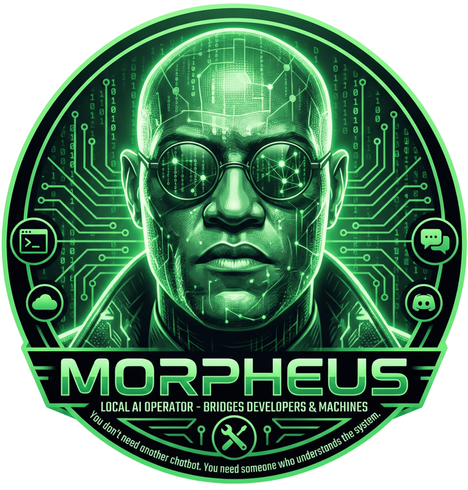

<div align="center">
  
</div>

# Morpheus

> **Morpheus is a local-first AI operator that bridges developers and machines.**

Morpheus is a local AI agent for developers, running as a CLI daemon that connects to **LLMs**, **local tools**, and **MCPs**, enabling interaction via **Terminal, Telegram, and Discord**. Inspired by the character Morpheus from *The Matrix*, the project acts as an **intelligent orchestrator**, bridging the gap between the developer and complex systems.

## Installation

Install Morpheus globally via npm:

```bash
npm install -g morpheus-cli
```

## Quick Start

### 1. Initialize

Set up your configuration (API keys, preferences):

```bash
morpheus init
```

### 2. Start the Agent

Run the background daemon and Web UI:

```bash
morpheus start
```

This will:
- Start the agent process
- Launch the Web UI at http://localhost:3333

### Other Commands

```bash
# Check if Morpheus is running
morpheus status

# Stop the agent
morpheus stop

# Diagnose issues
morpheus doctor
```

## Troubleshooting

### Command not found

If you installed successfully but can't run the `morpheus` command:

1.  **Check your PATH**: Ensure your global npm bin directory is in your system PATH.
    -   Run `npm bin -g` to see the folder.
    -   On Windows, this is usually `%APPDATA%\npm`.
    -   On Linux/Mac, verify `echo $PATH`.
2.  **Restart Terminal**: New installations might not be visible until you restart your shell.

## Using NPX
You can run Morpheus without installing it globally using `npx`:

```bash

npx morpheus-cli init

npx morpheus-cli start

```

## Technical Overview

Morpheus is built with **Node.js** and **TypeScript**, using **LangChain** as the orchestration engine. It runs as a background daemon process, managing connections to LLM providers (OpenAI, Anthropic, Ollama) and external channels (Telegram, Discord).

### Core Components

- **Runtime (`src/runtime/`)**: The heart of the application. Manages the Oracle (agent) lifecycle, provider instantiation, and command execution.
- **CLI (`src/cli/`)**: Built with `commander`, handles user interaction, configuration, and daemon control (`start`, `stop`, `status`).
- **Configuration (`src/config/`)**: Singleton-based configuration manager using `zod` for validation and `js-yaml` for persistence (`~/.morpheus/zaion.yaml`).
- **Channels (`src/channels/`)**: Adapters for external communication. Currently supports Telegram (`telegraf`) with strict user whitelisting.

## Features

### 🖥️ Web Dashboard
Local React-based UI to manage recordings, chat history, and system status across your agent instances.

#### 🔒 UI Authentication
To protect your Web UI, use the `THE_ARCHITECT_PASS` environment variable. This ensures only authorized users can access the dashboard and API.

**Option 1: Using a `.env` file**
Create a `.env` file in the root of your project:

```env
THE_ARCHITECT_PASS="your-secure-password"
```

**Option 2: Using Shell export**

```bash
export THE_ARCHITECT_PASS="your-secure-password"
morpheus start
```

When enabled:
- The Web UI will redirect to a Login page.
- API requests require the `x-architect-pass` header.
- The session is persisted locally in your browser.

### 🧩 MCP Support (Model Context Protocol)
Full integration with [Model Context Protocol](https://modelcontextprotocol.io/), allowing Morpheus to use standardized tools from any MCP-compatible server.

### 🧠 Sati (Long-Term Memory)
Morpheus features a dedicated middleware system called **Sati** (Mindfulness) that provides long-term memory capabilities.
-   **Automated Storage**: Automatically extracts and saves preferences, project details, and facts from conversations.
-   **Contextual Retrieval**: Injects relevant memories into the context based on your current query.
-   **Data Privacy**: Stored in a local, independent SQLite database (`santi-memory.db`), ensuring sensitive data is handled securely and reducing context window usage.
-   **Memory Management**: View and manage your long-term memories through the Web UI or via API endpoints.

### 📊 Usage Analytics
Track your token usage across different providers and models directly from the Web UI. View detailed breakdowns of input/output tokens and message counts to monitor costs and activity.

### 🎙️ Audio Transcription (Telegram)
Send voice messages directly to the Telegram bot. Morpheus will:
1. Transcribe the audio using **Google Gemini**.
2. Process the text as a standard prompt.
3. Reply with the answer.

*Requires a Google Gemini API Key.*

## Development Setup

This guide is for developers contributing to the Morpheus codebase.

### Prerequisites

- **Node.js**: >= 18.x
- **npm**: >= 9.x
- **TypeScript**: >= 5.x

### 1. Clone & Install

```bash
git clone https://github.com/your-org/morpheus.git
cd morpheus
npm install
```

### 2. Build

Compile TypeScript source to `dist/` and build the Web UI.

```bash
npm run build
```

### 3. Run the CLI

You can run the CLI directly from the source using `npm start`.

```bash
# Initialize configuration (creates ~/.morpheus)
npm start -- init

# Start the daemon
npm start -- start

# Check status
npm start -- status
```

### 4. Configuration

The configuration file is located at `~/.morpheus/zaion.yaml`. You can edit it manually or use the `morpheus config` command.

```yaml
agent:
  name: "Morpheus"
  personality: "stoic, wise, and helpful"
llm:
  provider: "openai" # options: openai, anthropic, ollama, gemini
  model: "gpt-4-turbo"
  temperature: 0.7
  context_window: 100 # Number of messages to load into LLM context
  api_key: "sk-..."
santi: # Optional: Sati (Long-Term Memory) specific settings
  provider: "openai" # defaults to llm.provider
  model: "gpt-4o"
  memory_limit: 1000 # Number of messages/items to retrieve
channels:
  telegram:
    enabled: true
    token: "YOUR_TELEGRAM_BOT_TOKEN"
    allowedUsers: ["123456789"] # Your Telegram User ID
  discord:
    enabled: false # Coming soon

# Web UI Dashboard
ui:
  enabled: true
  port: 3333

# Audio Transcription Support
audio:
  enabled: true
  apiKey: "YOUR_GEMINI_API_KEY" # Optional if llm.provider is 'gemini'
  maxDurationSeconds: 300
```

### 5. MCP Configuration

Morpheus supports external tools via **MCP (Model Context Protocol)**. Configure your MCP servers in `~/.morpheus/mcps.json`:

```json
{
  "coolify": {
    "transport": "stdio",
    "command": "npx",
    "args": ["-y", "@coolify/mcp-server"],
    "env": {
      "COOLIFY_URL": "https://app.coolify.io",
      "COOLIFY_TOKEN": "your-token"
    }
  },
  "coingecko": {
    "transport": "http",
    "url": "https://mcps.mnunes.xyz/coingecko/mcp"
  }
}
```

## API Endpoints

Morpheus exposes several API endpoints for programmatic access to its features:

### Sati Memories Endpoints

#### GET `/api/sati/memories`
Retrieve all memories stored by the Sati agent (long-term memory).

*   **Authentication:** Requires `Authorization` header with the password set in `THE_ARCHITECT_PASS`.
*   **Response:**
    ```json
    [
      {
        "id": "unique-id",
        "category": "work",
        "importance": "high",
        "summary": "Memory summary",
        "details": "Additional details of the memory",
        "hash": "unique-hash",
        "source": "source",
        "created_at": "2023-01-01T00:00:00.000Z",
        "updated_at": "2023-01-01T00:00:00.000Z",
        "last_accessed_at": "2023-01-01T00:00:00.000Z",
        "access_count": 5,
        "version": 1,
        "archived": false
      }
    ]
    ```

#### DELETE `/api/sati/memories/:id`
Archive (soft delete) a specific memory from the Sati agent.

*   **Authentication:** Requires `Authorization` header with the password set in `THE_ARCHITECT_PASS`.
*   **Parameters:** `id` - ID of the memory to archive.
*   **Response:**
    ```json
    {
      "success": true,
      "message": "Memory archived successfully"
    }
    ```

#### POST `/api/sati/memories/bulk-delete`
Archive (soft delete) multiple memories from the Sati agent at once.

*   **Authentication:** Requires `Authorization` header with the password set in `THE_ARCHITECT_PASS`.
*   **Body:**
    ```json
    {
      "ids": ["id1", "id2", "id3"]
    }
    ```
*   **Response:**
    ```json
    {
      "success": true,
      "message": "X memories archived successfully",
      "deletedCount": X
    }
    ```

## Testing

We use **Vitest** for testing.

```bash
# Run unit tests
npm test

# Run tests in watch mode
npm run test:watch
```

## Project Structure

```text
.
├── assets/          # Static assets
├── bin/             # CLI entry point (morpheus.js)
├── specs/           # Technical specifications & documentation
├── src/
│   ├── channels/    # Communication adapters (Telegram, etc.)
│   ├── cli/         # CLI commands and logic
│   ├── config/      # Configuration management
│   ├── runtime/     # Core agent logic, lifecycle, and providers
│   ├── types/       # Shared TypeScript definitions
│   └── ui/          # React Web UI Dashboard
└── package.json
```

## Roadmap

- [x] **Web Dashboard**: Local UI for management and logs.
- [x] **MCP Support**: Full integration with Model Context Protocol.
- [ ] **Discord Adapter**: Support for Discord interactions.
- [ ] **Plugin System**: Extend functionality via external modules.

## Contributing

1.  Fork the repository.
2.  Create a feature branch (`git checkout -b feature/amazing-feature`).
3.  Commit your changes (`git commit -m 'feat: Add amazing feature'`).
4.  Push to the branch (`git push origin feature/amazing-feature`).
5.  Open a Pull Request.

## License

MIT
